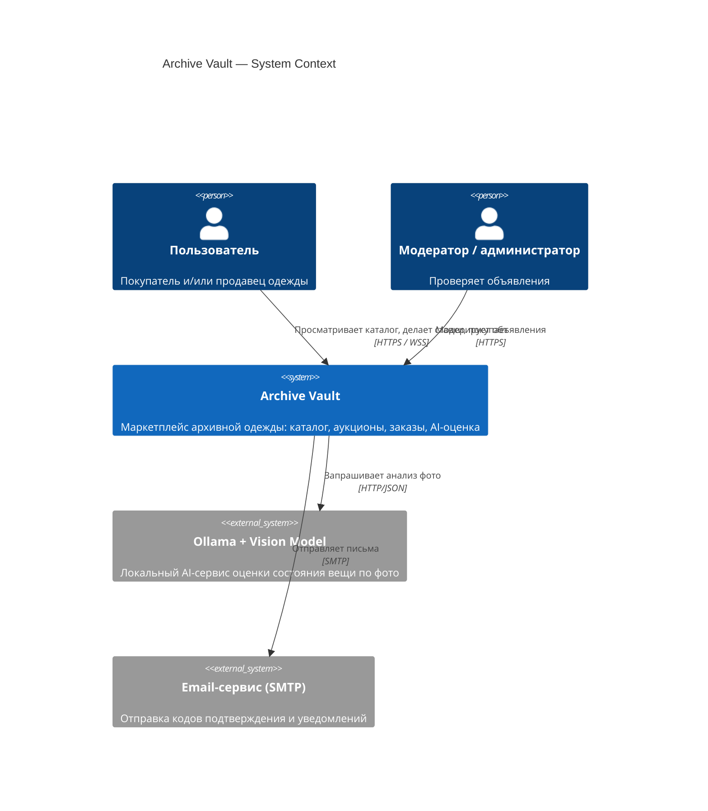
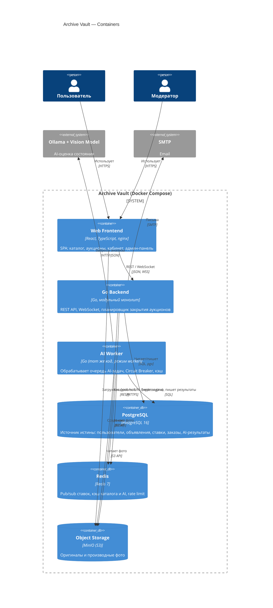
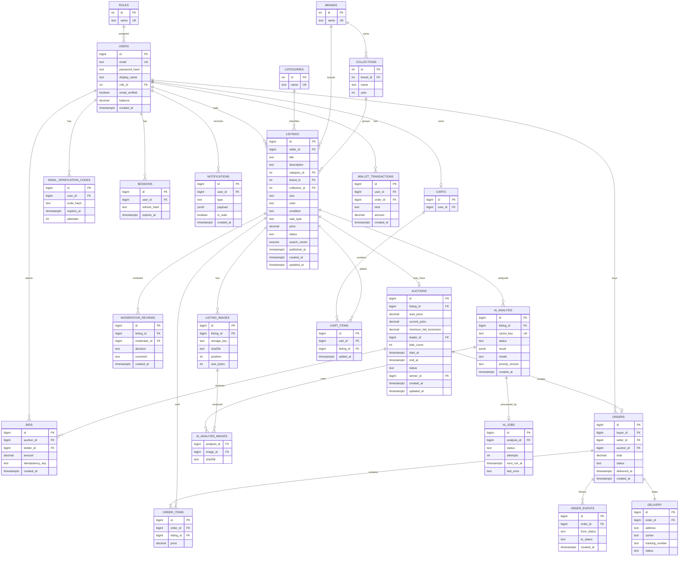
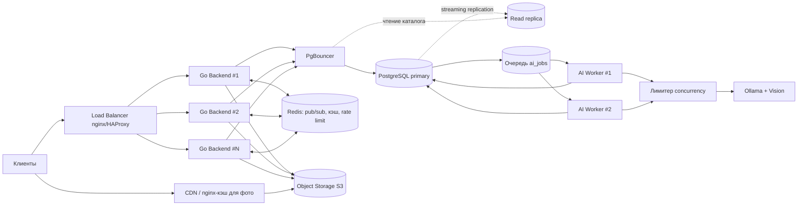

PolyClothes— маркетплейс архивной и винтажной одежды с аукционами и AI-оценкой состояния

Веб-приложение для покупки и продажи редкой, винтажной и коллекционной одежды: каталог с фильтрами, аукционы со ставками в реальном времени, безопасная сделка с виртуальными деньгами и AI-подсказка по состоянию вещи (Ollama + open-source vision-модель).

## Команда

| Участник           | Группа        | Роль                         | Зона ответственности                                                                      |
| ------------------ | ------------- | ---------------------------- | ----------------------------------------------------------------------------------------- |
| Четвериков Георгий | 5130904/40107 | A — Backend Core             | каркас backend, БД, авторизация, каталог, объявления, модерация, корзина, заказы, OpenAPI |
| Милорадов Евгений  | 5130904/40107 | B — Infrastructure & Testing | CI/CD, unit/integration/E2E, test-профиль Docker Compose, отчёты                          |
| Гринько Артем      | 5130904/40107 | C — Auctions & Load          | аукционы, ставки, конкурентность, WebSocket, Redis, k6                                    |
| Молчанов Кирилл    | 5130904/40107 | D — AI                       | Ollama, vision-модель, AI-клиент, очередь, Circuit Breaker, кэш, fallback                 |


## Проблема

Покупатели редкой и винтажной одежды не могут быстро и безопасно найти подлинную вещь нужного бренда и состояния: объявления разбросаны по соцсетям и барахолкам, фильтры по бренду, коллекции и состоянию отсутствуют, а честность описания состояния приходится принимать на веру. Продавцам сложно объективно оценить состояние и цену редкой вещи, а торги за уникальные вещи проходят в личных сообщениях без прозрачных правил, из-за чего ставки теряются, а победитель определяется спорно. Обе стороны боятся мошенничества: предоплата незнакомому человеку — риск, а получение вещи не того качества — частая ситуация.

## Тема проекта

Разработка клиент-серверного маркетплейса архивной одежды с каталогом, аукционами реального времени, имитацией безопасной сделки и вспомогательной AI-оценкой состояния вещи по фотографиям.

## Стек технологий

|Слой|Технологии|
|---|---|
|Backend|Go 1.23, модульный монолит; `chi` (HTTP), `pgx` (PostgreSQL), `go-redis`, `gorilla/websocket`, `sony/gobreaker` (Circuit Breaker), `slog` (JSON-логи в STDOUT), `golang-migrate`|
|База данных|PostgreSQL 16 (основное хранилище, источник истины)|
|Кэш / realtime|Redis 7 (pub/sub для WebSocket, кэш каталога, кэш AI-результатов, rate limit)|
|Frontend|React + TypeScript + Vite, TanStack Query, раздаётся через nginx|
|Внешняя зависимость|**Ollama** + open-source vision-модель (по умолчанию `qwen2.5vl:7b`; на момент реализации допускается замена на актуальный аналог)|
|Хранение фото|S3-совместимое хранилище MinIO (в БД только метаданные)|
|Контейнеризация|Docker, Docker Compose (профили `default`, `test`, `load`)|
|CI|GitHub Actions|
|Тесты|`go test`, `testcontainers-go`, Playwright (E2E), k6 (нагрузка)|
|Документация API|OpenAPI 3.1 (`api/openapi.yaml`), проверка `redocly lint`|

---

# Этап 2. Требования

## User Stories

### US-1. Поиск вещи в каталоге

**Как** покупатель, **когда** ищу конкретную вещь (например, куртку определённого бренда в хорошем состоянии), **я хочу** искать и фильтровать каталог по бренду, коллекции, категории, состоянию и цене, **чтобы** быстро найти подходящую вещь, не просматривая сотни объявлений.

Критерии готовности:

- Каталог показывает только объявления в статусах `APPROVED` и `AUCTION_ACTIVE`.
- Доступны фильтры: категория, бренд, коллекция, состояние, диапазон цены, тип продажи; фильтры комбинируются.
- Сортировка: новые, цена ↑, цена ↓, скоро заканчивается (для аукционов).
- Полнотекстовый поиск по названию и описанию; пагинация по 20 элементов.
- Карточка вещи показывает все параметры, фотографии, продавца, тип продажи и AI-подсказку (если есть).
- Ответ списка каталога: p95 ≤ 150 мс.

### US-2. Размещение объявления с AI-оценкой состояния

**Как** продавец, **когда** выставляю редкую вещь, **я хочу** загрузить 1–3 фотографии и получить предварительную AI-оценку состояния, износа, дефектов и ценового диапазона, **чтобы** корректно описать вещь и выбрать цену.

Критерии готовности:

- Форма требует обязательные поля: название, описание, категория, бренд, коллекция, размер, цвет, состояние (вручную), 1–3 фото, тип продажи, цена или параметры аукциона.
- После загрузки фото создаётся фоновая AI-задача; интерфейс показывает статус (в очереди / анализируется / готово / временно недоступно).
- Результат содержит состояние, износ 0–100, дефекты с confidence, положение относительно рынка, диапазон цены, общую confidence и помечен как «предварительная оценка, не экспертное заключение».
- Если AI недоступен, объявление всё равно можно отправить на модерацию с состоянием, указанным вручную; AI-анализ помечается `DEFERRED`/`UNAVAILABLE`.
- Если фото не изменились — повторный анализ берётся из кэша и в Ollama не отправляется.

### US-3. Участие в аукционе в реальном времени

**Как** покупатель, **когда** на интересующей меня вещи идут торги, **я хочу** видеть текущую цену и таймер и делать ставки, а также мгновенно узнавать, что меня перебили, **чтобы** успеть ответить до окончания аукциона.

Критерии готовности:

- Ставка принимается, только если `amount ≥ current_price + 5` (первая — `≥ start_price`); одинаковые и более низкие ставки отклоняются.
- Лидер не может перебить собственную ставку и не может уменьшить её.
- Текущая цена, число ставок и история обновляются по WebSocket без перезагрузки; при обрыве соединения клиент переподключается с экспоненциальной паузой, а после 3 неудач переходит на polling раз в 5 с.
- Пользователь видит свой статус: «Вы лидируете» / «Вас перебили» / «Вы не участвуете».
- После `end_at` ставки не принимаются; таймер не продлевается.
- Ответ на размещение ставки: p95 ≤ 200 мс.

### US-4. Покупка вещи с фиксированной ценой через безопасную сделку

**Как** покупатель, **когда** нашёл вещь с фиксированной ценой, **я хочу** добавить её в корзину, оформить заказ и отслеживать доставку, подтвердив получение только после проверки вещи, **чтобы** не рисковать деньгами при покупке у незнакомого продавца.

Критерии готовности:

- В корзину добавляются только объявления с фиксированной ценой; аукционные вещи отклоняются с кодом `409`.
- Заказ проходит статусы `ORDER_CREATED → PAYMENT_RESERVED → SELLER_SHIPPING → IN_TRANSIT → DELIVERED → BUYER_CONFIRMED → FUNDS_RELEASED → COMPLETED`.
- Виртуальная сумма резервируется при создании заказа и переводится продавцу только после подтверждения получения.
- Если покупатель не подтвердил получение в течение 7 дней после `DELIVERED`, сделка завершается автоматически.
- На каждом этапе стороны получают уведомления.

### US-5. Автоматический заказ победителю аукциона

**Как** победитель аукциона, **когда** торги завершились, **я хочу** автоматически получить заказ на выигранную вещь без корзины, **чтобы** не оформлять покупку второй раз и не потерять лот.

Критерии готовности:

- Победитель определяется автоматически после `end_at` (максимальная ставка); у аукциона ровно один победитель.
- Заказ создаётся автоматически и проходит ту же цепочку статусов, что и обычный.
- Победитель и продавец получают уведомления; проигравшие — уведомление о завершении.
- Если ставок не было, аукцион закрывается без победителя, продавец получает уведомление.

### US-6. Модерация объявлений

**Как** модератор, **когда** в очереди появляются новые или изменённые объявления, **я хочу** просматривать их и одобрять, отклонять либо запрашивать исправления, **чтобы** в каталоге оставались только корректные и аутентичные предложения.

Критерии готовности:

- Очередь показывает объявления `PENDING_MODERATION` от старых к новым с AI-подсказкой, если она есть.
- Доступны решения: одобрить, отклонить (с причиной), запросить исправления (с комментарием → объявление возвращается в `DRAFT`).
- Решение фиксируется в `moderation_reviews`; продавец получает уведомление.
- Редактирование опубликованного объявления снова отправляет его на модерацию.
- Модерацию могут выполнять только пользователи с ролью `ADMIN`/`MODERATOR`.

### UML-диаграмма прецедентов

**Акторы:** Гость, Покупатель, Продавец (Покупатель и Продавец — роли одного зарегистрированного Пользователя), Модератор, Система (планировщик), AI-подсистема (Ollama).

|Прецедент|Актор|Связи|
|---|---|---|
|Просмотреть каталог|Гость, Пользователь|`<<include>>` Применить фильтры и сортировку; `<<extend>>` Выполнить поиск|
|Просмотреть карточку вещи|Гость, Пользователь|`<<extend>>` Посмотреть AI-подсказку|
|Зарегистрироваться|Гость|`<<include>>` Подтвердить email кодом|
|Создать объявление|Продавец|`<<include>>` Загрузить фотографии; `<<extend>>` Запустить AI-анализ; `<<extend>>` Создать аукцион|
|Запустить AI-анализ|Продавец|`<<include>>` Проверить кэш; AI-подсистема (вторичный актор)|
|Отправить на модерацию|Продавец|`<<include>>` Уведомить модераторов|
|Модерировать объявление|Модератор|`<<include>>` Просмотреть объявление; `<<extend>>` Запросить исправления; `<<extend>>` Отклонить|
|Сделать ставку|Покупатель|`<<include>>` Проверить правила ставки; `<<extend>>` Уведомить перебитого участника|
|Следить за аукционом|Пользователь|`<<include>>` Подключиться к WebSocket|
|Добавить в корзину|Покупатель|`<<include>>` Проверить тип продажи (только фиксированная цена)|
|Оформить заказ|Покупатель|`<<include>>` Зарезервировать виртуальные средства|
|Закрыть аукцион и создать заказ|Система|`<<include>>` Определить победителя; `<<include>>` Оформить заказ|
|Обновить статус доставки|Продавец, Система|`<<extend>>` Уведомить покупателя|
|Подтвердить получение|Покупатель|`<<include>>` Перевести средства продавцу|

## Масштаб системы — оценка нагрузки

**Базовый сценарий: 10 000 уникальных пользователей в сутки (DAU).**

### Допущения по поведению пользователей

|№|Допущение|Значение|
|---|---|---|
|A1|Просмотров страниц каталога (смена фильтров, сортировки, пагинация) на пользователя|8|
|A2|Поисковых запросов на пользователя|3|
|A3|Открытий карточек вещей на пользователя|12|
|A4|Доля пользователей, заходящих в раздел аукционов|20 % (2 000 чел.), 10 списков на посетителя в сутки → 20 000 запросов|
|A5|Доля пользователей, делающих ставки|10 % (1 000 чел.) × 3 ставки = 3 000 ставок/сутки|
|A6|Авторизаций (login) в сутки|6 000 (60 % DAU; остальные продолжают сессию по refresh-токену)|
|A7|Новые регистрации|300/сутки (+100 повторных отправок кода)|
|A8|Создание объявлений|2 % DAU = 200/сутки; 20 % из них — аукционы (40/сутки); 2,5 фото на объявление|
|A9|Доля объявлений с запросом AI-анализа|70 % → 140 анализов/сутки|
|A10|Заказы|250 с фиксированной ценой (из 500 пользователей, добавивших товары в корзину) + 30 по итогам аукционов = 280 заказов/сутки|
|A11|Модерация|300 объявлений/сутки (200 новых + 100 правок)|
|A12|Уведомления (создание записей)|≈ 4 000/сутки (перебитые ставки ≈ 2 000, модерация ≈ 600, заказы ≈ 1 100, AI и аукционные события ≈ 300)|
|A13|Распределение нагрузки по времени|в час пик приходится 12 % суточного трафика (K_пик = 0,12)|
|A14|WebSocket|2 600 сессий/сутки, средняя длительность 10 минут|

### Read/Write профиль

|Операция|Тип|Запросов/сутки|
|---|---|--:|
|Список каталога (фильтры, сортировка) — 10 000 × 8|Read|80 000|
|Поиск — 10 000 × 3|Read|30 000|
|Справочники: бренды, категории, коллекции|Read|10 000|
|Карточка вещи — 10 000 × 12|Read|120 000|
|Список аукционов|Read|20 000|
|Карточка аукциона|Read|15 000|
|История ставок|Read|6 000|
|Текущая ставка (polling-fallback, обновление страницы)|Read|5 000|
|Получение текущего пользователя `/auth/me`|Read|20 000|
|Мои объявления|Read|3 000|
|Просмотр корзины|Read|1 500|
|История заказов|Read|1 500|
|Карточка заказа|Read|1 000|
|Профиль и статистика|Read|4 000|
|Список уведомлений / счётчик непрочитанных|Read|30 000|
|AI: статус анализа (polling)|Read|1 400|
|AI: получение результата|Read|140|
|Результат аукциона|Read|500|
|Админ: список модерации|Read|100|
|Админ: просмотр объявления|Read|300|
|Регистрация|Write|300|
|Подтверждение email кодом|Write|300|
|Повторная отправка кода|Write|100|
|Login (создание сессии)|Write|6 000|
|Logout|Write|3 000|
|Размещение ставки|Write|3 000|
|Создание объявления|Write|200|
|Редактирование объявления|Write|100|
|Снятие с продажи|Write|30|
|Загрузка фотографий (1 запрос = 1 фото)|Write|500|
|Запуск AI-анализа|Write|140|
|Создание аукциона|Write|40|
|Отмена аукциона|Write|2|
|Добавление в корзину|Write|1 000|
|Удаление из корзины|Write|200|
|Оформление заказа (фикс. цена)|Write|250|
|Автосоздание заказа по аукциону|Write|30|
|Смена статуса доставки (≈ 3 перехода на заказ)|Write|840|
|Подтверждение получения|Write|250|
|Решения модератора|Write|300|
|Пометка уведомлений прочитанными|Write|2 000|
|Создание уведомлений (внутренняя запись)|Write|4 000|
|**Итого Read**||**349 440**|
|**Итого Write**||**22 582**|
|**Всего**||**372 022**|

WebSocket-подключения (2 600/сутки) в таблицу не входят — это долгоживущие соединения, они считаются отдельно.

**Расчёт:**

- Read = 349 440 (93,9 %); Write = 22 582 (6,1 %).
- **Read/Write = 349 440 / 22 582 ≈ 15,5 : 1** — система существенно читающая → упор на кэширование и индексы чтения.
- Средний RPS = 372 022 / 86 400 ≈ **4,3 RPS**.
- Пиковый RPS = 372 022 × 0,12 / 3 600 ≈ **12,4 RPS** (Read ≈ 11,6; Write ≈ 0,75). Расчётный запас на всплески ×2 → проектный целевой уровень **25 RPS**.

**Пиковая нагрузка на ставки:**

|Показатель|Расчёт|Значение|
|---|---|--:|
|Среднее|3 000 / 86 400|0,035 RPS|
|Час пик|40 % ставок за час: 1 200 / 3 600|0,33 RPS|
|«Горячий» аукцион (финал)|10 % суточных ставок = 300; 50 % из них в последние 5 минут: 150 / 300 с|0,5 RPS на аукцион|
|Одновременно «горячих» аукционов|≤ 3|≤ 1,5 RPS суммарно|
|Стресс-тест (запас)|100 одновременных ставок на один аукцион|≈ ×200 к реальному пику|

Так как конец аукциона фиксирован и не продлевается, ставки концентрируются перед `end_at` (sniping). Реальная нагрузка мала, поэтому тест на 100 параллельных ставок проверяет корректность блокировок, а не производительность.

**Пиковое число WebSocket-соединений:**

- Среднее одновременных = 2 600 × 600 с / 86 400 с ≈ **18**.
- Час пик: 2 600 × 0,12 = 312 сессий × 600 / 3 600 ≈ **52** одновременных.
- Финал популярного аукциона: ×2 → **≈ 100**.
- Проектный предел одного экземпляра backend: **500** соединений (запас ×5).

### Сетевой трафик

**Допущения по размерам JSON (без изображений, только URL фото):**

|Ответ|Размер|Запросов|Объём, КБ|
|---|--:|--:|--:|
|Список каталога (20 позиций × ≈ 600 Б)|12 КБ|80 000|960 000|
|Поиск|12 КБ|30 000|360 000|
|Справочники|3 КБ|10 000|30 000|
|Карточка вещи|4 КБ|120 000|480 000|
|Список аукционов (20 × 700 Б)|14 КБ|20 000|280 000|
|Карточка аукциона|5 КБ|15 000|75 000|
|История ставок (до 50 × 120 Б)|6 КБ|6 000|36 000|
|Уведомления (10 × 250 Б)|2,5 КБ|30 000|75 000|
|`/auth/me`, текущая ставка, статусы AI, результат аукциона|0,3–1 КБ|≈ 47 000|≈ 12 000|
|Прочие чтения (мои объявления, корзина, заказы, профиль, админ)|2–15 КБ|≈ 11 400|≈ 50 000|
|**Итого Read-ответов**|**6,75 КБ в среднем**|**349 440**|**≈ 2 358 000 КБ**|

- Исходящий JSON-трафик API: **≈ 2,36 ГБ/сутки** (≈ 71 ГБ/месяц); с gzip (≈ ×4) ≈ **0,6 ГБ/сутки**, ≈ 18 ГБ/месяц.
- Ответы на Write (≈ 0,5 КБ × 22 582) ≈ 11 МБ/сутки.
- Входящий трафик: заголовки и тела запросов ≈ 0,27 ГБ/сутки.
- Средняя пропускная способность JSON: 2,36 ГБ × 8 / 86 400 ≈ 0,22 Мбит/с; в час пик ≈ 0,63 Мбит/с.
- **Средний размер JSON-ответа ≈ 6,75 КБ.**

**Изображения (считаются отдельно):**

|Статья|Расчёт|Объём/сутки|
|---|---|--:|
|Миниатюры в списках (WebP 400 px, 15 КБ)|130 000 просмотров списков × 20 × 15 КБ = 39 ГБ; hit браузерного кэша 60 %|15,6 ГБ|
|Фото в карточках (WebP 1200 px, 150 КБ)|135 000 открытий × 2 фото × 150 КБ = 40,5 ГБ; hit кэша 40 %|24,3 ГБ|
|**Итого изображения (исходящие)**||**≈ 40 ГБ/сутки, ≈ 1,2 ТБ/месяц**|
|Загрузка фото продавцами (после клиентского сжатия ≤ 1,5 МБ)|500 × 1,5 МБ|0,75 ГБ/сутки (входящие)|

Среднее ≈ 3,7 Мбит/с, пик (12 % в час) ≈ **10,7 Мбит/с**. Изображения в ≈ 17 раз превосходят JSON → отдаём их напрямую из объектного хранилища через nginx/CDN, а не через Go backend.

**WebSocket-трафик:**

- События ставок: 3 000 ставок × в среднем 15 наблюдателей × 300 Б = 13,5 МБ/сутки.
- Ping/pong (каждые 30 с, ≈ 10 Б): 2 600 сессий × 40 пакетов × 10 Б ≈ 1 МБ/сутки.
- Уведомления «вас перебили»: 2 000 × 250 Б = 0,5 МБ/сутки.
- **Итого ≈ 15 МБ/сутки** — пренебрежимо мало.

**AI-трафик backend ↔ Ollama (внутренняя сеть Docker):**

- Фото для AI уменьшаются до 1024 px JPEG ≈ 200 КБ, в base64 ≈ 267 КБ.
- На запрос: 2,5 фото × 267 КБ + промпт ≈ **0,67 МБ**, ответ ≈ 1 КБ.
- 140 анализов + 15 % повторов (retry) = 161 запрос/сутки × 0,67 МБ ≈ **108 МБ/сутки**; кэш по хэшу фото снижает эту цифру при повторных анализах.

### Объём хранения за 5 лет

**Горизонт:** 5 × 365 = 1 825 суток. Нагрузка стабильна (10 000 DAU). Размер строки включает заголовок, данные и индексы.

|Таблица|Строк за 5 лет|Строк × размер|Объём|
|---|--:|---|--:|
|`users` (+ роль)|547 500 (300/сут)|× 0,5 КБ|273,8 МБ|
|`email_verification_codes` (хранение 30 дней)|≈ 12 000|× 0,15 КБ|1,8 МБ|
|`categories`, `brands`, `collections`|≈ 3 500|× 0,3 КБ|≈ 1 МБ|
|`listings`|365 000 (200/сут)|× 2 КБ|730 МБ|
|GIN-индекс полнотекстового поиска|365 000|× 1 КБ|365 МБ|
|`listing_images` (метаданные)|912 500 (2,5/объявл.)|× 0,4 КБ|365 МБ|
|`auctions`|73 000 (40/сут)|× 0,4 КБ|29,2 МБ|
|`bids`|5 475 000 (3 000/сут)|× 0,14 КБ|766,5 МБ|
|`carts`|≈ 164 250|× 0,1 КБ|16,4 МБ|
|`cart_items`|1 825 000|× 0,12 КБ|219 МБ|
|`orders`|511 000 (280/сут)|× 0,4 КБ|204,4 МБ|
|`order_items`|511 000|× 0,15 КБ|76,7 МБ|
|`order_events` (8 переходов на заказ)|4 088 000|× 0,1 КБ|408,8 МБ|
|`delivery`|511 000|× 0,3 КБ|153,3 МБ|
|`wallet_transactions` (3 проводки на заказ)|1 533 000|× 0,12 КБ|184 МБ|
|`moderation_reviews`|547 500 (300/сут)|× 0,4 КБ|219 МБ|
|`ai_analysis` (JSON-результат ≈ 1 КБ)|255 500 (140/сут)|× 2,5 КБ|638,8 МБ|
|`ai_analysis_images`|638 750|× 0,1 КБ|63,9 МБ|
|`ai_jobs`|293 825 (161/сут)|× 0,25 КБ|73,5 МБ|
|`notifications`|7 300 000 (4 000/сут)|× 0,33 КБ|2 409 МБ|
|`sessions` (refresh-токены, TTL 30 дней)|≈ 180 000|× 0,2 КБ|36 МБ|
|**Итого PostgreSQL**|||**≈ 7 235 МБ ≈ 7,2 ГБ**|
|С запасом ×1,5 (WAL, bloat, служебные данные)|||**≈ 10,9 ГБ**|

Retention-политика для `notifications` (хранить 12 месяцев) сокращает её до ≈ 0,5 ГБ.

**Изображения:**

|Допущение|Значение|
|---|---|
|Объявлений за 5 лет|365 000|
|Фотографий на объявление|2,5 (диапазон 1–3)|
|Всего фотографий|912 500|
|Размер одной фотографии в трёх вариантах|оригинал WebP 2048 px ≈ 400 КБ + medium 1200 px ≈ 150 КБ + thumbnail 400 px ≈ 15 КБ = **565 КБ**|
|**Итого за 5 лет**|912 500 × 565 КБ ≈ **515,6 ГБ ≈ 0,52 ТБ**|
|С резервной копией (×2)|≈ 1,05 ТБ|

**Итого за 5 лет:** БД ≈ 10,9 ГБ + изображения ≈ 516 ГБ ≈ **0,53 ТБ** (≈ 1,05 ТБ с бэкапами).

**Выводы:**

|Вопрос|Решение|
|---|---|
|Партиционирование PostgreSQL|Не требуется на ×1: самые большие таблицы — `notifications` (7,3 млн строк) и `bids` (5,5 млн) — комфортно обслуживаются обычными индексами. При ×10 — помесячное партиционирование `notifications`, `bids`, `order_events`.|
|Отдельное файловое хранилище|**Обязательно**: 99 % объёма — фото (≈ 516 ГБ против ≈ 11 ГБ в БД). Хранение в PostgreSQL недопустимо (раздувание БД, бэкапы, кэш). Используем MinIO (S3).|
|CDN|На ×1 не обязателен (пик ≈ 11 Мбит/с отдаёт nginx с кэшем). При ×10 (≈ 107 Мбит/с, ≈ 400 ГБ/сутки) — рекомендуется.|

## Отказоустойчивость (Fault Tolerance)

**Главная внешняя зависимость — Ollama + vision-модель.** AI является **вспомогательной подсистемой и не блокирует основную работу маркетплейса**: каталог, аукционы, корзина, заказы и публикация объявлений работают при любом состоянии AI.

> **Бизнес-правило.** Если AI недоступен, пользователь всё равно может разместить объявление. Он указывает состояние вещи вручную, а система помечает AI-анализ как временно недоступный.

### Архитектурные принципы

- HTTP-запрос пользователя **никогда** не обращается к Ollama синхронно: он создаёт запись `ai_jobs` и сразу получает `202 Accepted`.
- Задачи выполняет отдельный процесс **AI worker** (тот же Go-кодовая база, другой режим запуска) с ограниченной concurrency (по умолчанию 1 одновременный запрос к Ollama).
- Состояние объявления не зависит от AI: поле `condition` заполняется вручную, `ai_analysis` — необязательная подсказка.

### Конфигурация защитных механизмов

|Механизм|Параметры|
|---|---|
|**Timeout**|HTTP-запрос к Ollama — 30 с на попытку; общий дедлайн задачи — 90 с; для проверки здоровья `GET /api/tags` — 2 с|
|**Circuit Breaker** (`gobreaker`)|Closed → Open после 5 последовательных ошибок (timeout, 5xx, connection refused); в Open — 60 с, запросы к Ollama не отправляются; Half-Open — пропускается 1 пробный запрос; 2 успеха подряд → Closed|
|**Retry**|Только для временных ошибок (timeout, connection refused, 502/503, ошибка загрузки модели): до 2 повторов, задержки 5 с и 20 с с jitter ±20 %. Для некорректного JSON — **1** повтор со строгим промптом и `temperature=0`. Для 4xx, повреждённого фото и подтверждённого отсутствия вещи на фото — **без retry**|
|**Кэширование**|Ключ = `sha256(отсортированные sha256 каждого фото + model + prompt_version + schema_version)`. Хранится в `ai_analysis.cache_key` (UNIQUE) и дублируется в Redis (TTL 30 дней). При cache hit фото в Ollama не отправляются|
|**Fallback**|Состояние вещи указывается вручную; AI-блок скрыт или показывает «Оценка временно недоступна»|
|**Очередь**|PostgreSQL-таблица `ai_jobs` + `SELECT ... FOR UPDATE SKIP LOCKED` (Redis не обязателен); статусы `QUEUED, RUNNING, SUCCEEDED, RETRY_WAIT, DEFERRED, FAILED, UNAVAILABLE`|

### Поведение при отказах

|Сценарий|Поведение системы|Статус задачи|UI / объявление|
|---|---|---|---|
|Ollama недоступен (connection refused)|5 ошибок → Circuit Breaker Open на 60 с; новые задачи не отправляются в Ollama|`DEFERRED`|«AI временно недоступен. Укажите состояние вручную»; публикация разрешена|
|Timeout 30 с|До 2 повторов с backoff; после исчерпания — ошибка засчитывается в Circuit Breaker|`RETRY_WAIT` → `DEFERRED`|Статус «анализируется»; через 90 с — «временно недоступно», уведомление «AI-анализ недоступен»|
|Ошибка модели (500, model not loaded, OOM)|Retry как для временной ошибки; предупреждение в логах|`RETRY_WAIT` → `DEFERRED`|То же|
|Некорректный JSON|Валидация по JSON Schema; 1 повтор со строгим промптом; затем отказ|`FAILED` (причина `INVALID_MODEL_OUTPUT`)|«Не удалось получить оценку»; ручной ввод|
|Слишком долгая обработка (> 90 с)|Контекст отменяется; результат не принимается|`DEFERRED`|«AI не успел обработать фото»|
|Временная недоступность модели (идёт загрузка)|Healthcheck → Open; worker приостанавливает выборку задач|`DEFERRED`|Как при недоступности|
|Невозможно обработать фото|Предобработка (декодирование, ресайз) завершается ошибкой|`FAILED` (`IMAGE_PROCESSING_ERROR`)|«Не удалось обработать фото, загрузите другое»|
|Повреждённое/неподдерживаемое фото|Проверка magic bytes, размера (≤ 10 МБ) и формата (JPEG/PNG/WebP) до сохранения|Отказ на загрузке (`415`/`422`)|Сообщение у конкретного фото; другие фото сохраняются|
|Нет вещи на фото / низкое качество|Модель возвращает `condition = "unknown"`, низкую confidence|`SUCCEEDED` (с флагом `needs_better_photos`)|Подсказка «загрузите чёткие фото вещи»; оценка не показывается как итоговая|
|Невозможно определить состояние|`confidence < 0,4`|`SUCCEEDED`, `LOW_CONFIDENCE`|«Недостаточно данных для оценки»|
|Очевидные дефекты на хороших фото|Дефекты попадают в `defects[]`|`SUCCEEDED`|Показываются типы дефектов и confidence|

### Фоновая очередь при восстановлении

- Задачи `DEFERRED` не теряются; worker раз в 30 с проверяет состояние Circuit Breaker.
- После перехода Closed worker обрабатывает отложенные задачи по порядку создания, не превышая лимит concurrency.
- Срок жизни `DEFERRED` — 24 часа; после этого задача получает `UNAVAILABLE`, пользователь получает уведомление и может запустить анализ вручную.
- Объявление в любом из этих состояний остаётся полностью работоспособным; результат AI при завершении добавляется как подсказка и не меняет `condition`, указанное продавцом.

### Поведение интерфейса

- Опрос статуса `GET /ai/analyses/{id}` каждые 3 с до 2 минут (затем — только уведомление).
- Бейджи статусов: «в очереди», «анализируется», «готово», «недоступно».
- Кнопка «Опубликовать» никогда не блокируется статусом AI.
- AI-оценка всегда подписана «предварительная оценка, не экспертное заключение».

---

# Этап 3. Архитектура и детальное проектирование

## Анализ нагрузок (Capacity Planning)

Расчёты Read/Write, трафика и хранения выполнены на **Этапе 2**. Их влияние на проектные решения:

|Компонент|Показатель|Влияние на решение|
|---|---|---|
|PostgreSQL|Read/Write ≈ 15,5:1; пик ≈ 12,4 RPS (≈ 25–40 QPS с учётом нескольких запросов на HTTP-вызов); БД ≈ 11 ГБ за 5 лет|Один инстанс покрывает нагрузку ×1 с большим запасом; упор на индексы чтения; репликация — только при ×10|
|Индексы|Каталог и карточки — 57 % всех запросов; ставки — до 1,5 RPS|Составные и частичные индексы под фильтры каталога; индексы `bids(auction_id, created_at)` и `auctions(status, end_at)`|
|Redis|Кэш каталога (230 000 запросов/сутки на чтение каталога и карточек), pub/sub ставок, AI-кэш|Объём < 256 МБ; политика `allkeys-lru`; потеря Redis не приводит к потере данных|
|WebSocket|≈ 100 соединений в пике (лимит 500)|Один экземпляр backend справляется; для ×10 нужен Redis pub/sub между экземплярами|
|Backend|12,4 RPS в пик, проектный уровень 25 RPS|Один контейнер Go достаточен; stateless-дизайн готов к горизонтальному масштабированию|
|AI-очередь|140–161 запросов/сутки, 20–40 с на запрос, 1 worker|Утилизация worker ≈ 161 × 30 / 86 400 ≈ 6 %; очередь выдерживает всплески|
|Файловое хранилище|≈ 516 ГБ за 5 лет, ≈ 40 ГБ/сутки исходящего трафика, пик ≈ 11 Мбит/с|Фото только в MinIO; раздача через nginx с кэшем; CDN — при росте|

## C4 Model — Context diagram



**Описание.** Система взаимодействует с двумя типами пользователей и двумя внешними системами. Ollama — единственная критичная для функции AI внешняя зависимость; её отказ не останавливает основной функционал. Email-сервис в учебном проекте заменяется локальным SMTP-заглушкой (MailHog); основной канал уведомлений — внутренний. Файловое хранилище, PostgreSQL и Redis находятся внутри границы системы и показаны на Container diagram.

## C4 Model — Container diagram



**Внутренняя структура монолита** (пакеты `internal/`): `auth`, `catalog`, `listings`, `moderation`, `auctions`, `cart`, `orders`, `ai`, `notifications`, `storage`, `platform` (конфигурация, логи, БД). Модули общаются через интерфейсы внутри одного процесса, не по сети.

**Почему не микросервисы.** Команда из 4 человек, нагрузка ≈ 12 RPS в пике, единая БД с транзакциями между аукционами, заказами и объявлениями. Микросервисы добавили бы распределённые транзакции и сложность деплоя без выгоды. AI worker вынесен в отдельный **процесс** (не сервис): он масштабируется и падает независимо, но использует общий код и БД.

**Почему AI worker, а не вызов Ollama из backend.** Анализ занимает 20–40 с; синхронный вызов блокировал бы HTTP-соединения и обрушил бы p95. Очередь изолирует отказы Ollama от пользовательских запросов.

## Контракты API

Базовый путь `/api/v1`, формат JSON, авторизация — `Authorization: Bearer <access_token>`. Полная спецификация — `api/openapi.yaml`. Единый формат ошибки: `{"error": {"code": "BID_TOO_LOW", "message": "...", "request_id": "..."}}`.

|Метод|Путь|Назначение|Целевая latency (p95)|
|---|---|---|---|
|**Authentication**||||
|POST|`/auth/register`|Регистрация, отправка кода на email|300 мс|
|POST|`/auth/verify-email`|Подтверждение email кодом|150 мс|
|POST|`/auth/resend-code`|Повторная отправка кода (лимит 3/час)|200 мс|
|POST|`/auth/login`|Вход, выдача access + refresh токенов|250 мс|
|POST|`/auth/refresh`|Обновление access-токена|100 мс|
|POST|`/auth/logout`|Выход, отзыв refresh-токена|100 мс|
|GET|`/auth/me`|Текущий пользователь|50 мс|
|**Catalog**||||
|GET|`/items`|Список вещей: фильтры `category`, `brand`, `collection`, `condition`, `price_min`, `price_max`, `sale_type`; сортировка `sort`; пагинация `cursor`|150 мс|
|GET|`/items/search?q=`|Полнотекстовый поиск|250 мс|
|GET|`/items/{id}`|Карточка вещи|100 мс|
|GET|`/brands`|Список брендов|50 мс (кэш)|
|GET|`/categories`|Список категорий|50 мс (кэш)|
|GET|`/collections`|Список коллекций (фильтр по бренду)|50 мс (кэш)|
|**Listings**||||
|POST|`/listings`|Создание объявления (черновик)|200 мс|
|PUT|`/listings/{id}`|Редактирование (с проверкой правил блокировки)|200 мс|
|POST|`/listings/{id}/submit`|Отправка на модерацию|150 мс|
|POST|`/listings/{id}/remove`|Снятие с продажи|150 мс|
|POST|`/listings/{id}/images`|Загрузка фото (multipart, ≤ 10 МБ)|1 500 мс|
|DELETE|`/listings/{id}/images/{imageId}`|Удаление фото|150 мс|
|GET|`/me/listings`|Мои объявления|150 мс|
|**Moderation** (роль MODERATOR/ADMIN)||||
|GET|`/moderation/listings?status=PENDING_MODERATION`|Очередь модерации|200 мс|
|GET|`/moderation/listings/{id}`|Просмотр объявления|150 мс|
|POST|`/moderation/listings/{id}/approve`|Одобрить|200 мс|
|POST|`/moderation/listings/{id}/reject`|Отклонить (причина обязательна)|200 мс|
|POST|`/moderation/listings/{id}/request-changes`|Запросить исправления|200 мс|
|**Auctions**||||
|GET|`/auctions`|Список активных аукционов|150 мс|
|GET|`/auctions/{id}`|Карточка аукциона (цена, мин. следующая ставка, статус пользователя)|100 мс|
|POST|`/auctions`|Создание аукциона для одобренного объявления|250 мс|
|POST|`/auctions/{id}/cancel`|Отмена (только в первые 24 ч после публикации)|200 мс|
|GET|`/auctions/{id}/current-bid`|Текущая ставка|50 мс|
|POST|`/auctions/{id}/bids`|Размещение ставки (заголовок `Idempotency-Key`)|200 мс|
|GET|`/auctions/{id}/bids`|История ставок|100 мс|
|GET|`/auctions/{id}/result`|Результат аукциона (победитель, заказ)|100 мс|
|WS|`/ws/auctions/{id}`|События: `bid_placed`, `outbid`, `auction_finished`, `auction_cancelled`|подключение 200 мс; доставка события ≤ 500 мс|
|**Cart** (только фиксированная цена)||||
|GET|`/cart`|Корзина|100 мс|
|POST|`/cart/items`|Добавить (для аукциона — `409 AUCTION_ITEM_NOT_ALLOWED`)|150 мс|
|DELETE|`/cart/items/{listingId}`|Удалить|100 мс|
|**Orders**||||
|POST|`/orders/checkout`|Оформление заказа из корзины (резерв средств)|400 мс|
|GET|`/orders`|История заказов|150 мс|
|GET|`/orders/{id}`|Карточка заказа|100 мс|
|PATCH|`/orders/{id}/delivery`|Смена статуса доставки (продавец: `SELLER_SHIPPING`, `IN_TRANSIT`, `DELIVERED`)|200 мс|
|POST|`/orders/{id}/confirm`|Подтверждение получения покупателем|250 мс|
|POST|`/wallet/topup`|Пополнение виртуального баланса (демо)|150 мс|
|**Profile & Notifications**||||
|GET|`/me/profile`|Данные и статистика (продажи, покупки, победы, активные объявления)|150 мс|
|GET|`/me/bids`|История ставок пользователя|150 мс|
|GET|`/notifications`|Список уведомлений|100 мс|
|POST|`/notifications/read`|Отметить прочитанными|100 мс|
|**AI**||||
|POST|`/listings/{id}/ai-analysis`|Запуск анализа → `202 Accepted` + `analysis_id`|150 мс|
|GET|`/ai/analyses/{id}`|Статус анализа|50 мс|
|GET|`/ai/analyses/{id}/result`|Результат (JSON)|100 мс|
|**Служебные**||||
|GET|`/healthz`, `/readyz`|Проверка живости и готовности|20 мс|

**Нефункциональные требования API:** общий доступный уровень ≥ 99 % для чтения при деградации AI; на всех эндпоинтах — таймаут обработки 5 с (кроме загрузки фото — 15 с); rate limit 60 запросов/мин на пользователя и 10 ставок/мин на пользователя на аукцион; каждый запрос получает `request_id`, попадающий в логи STDOUT.

**Формат результата AI** (`GET /ai/analyses/{id}/result`):

```json
{
  "status": "SUCCEEDED",
  "condition": "good",
  "wear_level": 25,
  "defects": [
    {"type": "small_stain", "description": "Небольшое пятно на левом рукаве", "confidence": 0.82}
  ],
  "estimated_market_position": "above_market",
  "estimated_price": {"min": 180, "max": 240, "currency": "USD"},
  "confidence": 0.79,
  "disclaimer": "Предварительная оценка, не является экспертным заключением"
}
```

Результат валидируется по JSON Schema: `condition ∈ {new, excellent, good, fair, poor, unknown}`, `wear_level ∈ [0,100]`, `confidence ∈ [0,1]`, `estimated_price.min ≤ max`.

## Проектирование данных (ER-диаграмма)



**Ключевые проектные решения:**

- Денежные значения — `NUMERIC(12,2)`; для ставок `CHECK (amount > 0)`.
- `auctions.current_price`, `leader_id`, `bids_count` — денормализованное состояние для чтения без агрегации по `bids`.
- `bids` — append-only, `UNIQUE (auction_id, amount)` запрещает одинаковые ставки на уровне БД; `UNIQUE (auction_id, idempotency_key)` защищает от повторной отправки.
- `listings.status` — `CHECK` по набору `DRAFT, PENDING_MODERATION, APPROVED, REJECTED, REMOVED, SOLD, AUCTION_ACTIVE, AUCTION_FINISHED`.
- `listing_images` хранит только `storage_key` и `sha256` (файлы в MinIO); хэши используются для ключа AI-кэша.
- `ai_analysis.cache_key UNIQUE` реализует кэш результата на уровне БД.

### Правила аукциона

|№|Правило|Реализация|
|---|---|---|
|1|Фиксированные дата/время начала и окончания|Поля `start_at`, `end_at`; закрытие — планировщиком по `end_at`|
|2|Таймер не продлевается|Нет логики продления; `end_at` не изменяется после создания|
|3|Минимальный шаг — 5 USD|`minimum_bid_increment = 5.00` (в `CHECK` и в конфигурации)|
|4|Ставка строго выше текущей минимум на 5|`amount >= current_price + minimum_bid_increment`; для первой ставки `amount >= start_price`|
|5|Одинаковые ставки запрещены|Проверка в транзакции + `UNIQUE(auction_id, amount)`|
|6|Нельзя перебивать собственную ставку|Проверка `leader_id <> bidder_id` в транзакции|
|7–8|Отмена только в первые сутки после публикации|Разрешено, если `now() <= published_at + 24h` и статус `ACTIVE`/`SCHEDULED`; иначе `409`. Все участники уведомляются|
|9|Лидер не может уменьшить ставку|Снижение/отзыв ставок не реализован; новая ставка лидера отклоняется по правилу 6|
|10|Перебитый может ставить снова|Проверка 6 касается только текущего лидера|
|11|Победитель определяется автоматически после `end_at`|Планировщик (раз в 5 с): `status = FINISHED`, `winner_id = leader_id`|
|12|Выигранный аукцион автоматически создаёт заказ без корзины|В той же транзакции закрытия создаётся `orders` (источник — `auction_id`) со статусом `ORDER_CREATED`|

**Первая ставка** — не менее `start_price`; ставка после `end_at`, на отменённый или завершённый аукцион отклоняется. Время сверяется по часам БД (`now()`), а не по часам клиента или backend.

### Конкурентные ставки

Размещение ставки — одна транзакция PostgreSQL (`READ COMMITTED`) с блокировкой строки аукциона:

```sql
BEGIN;  -- READ COMMITTED

-- 1. Блокируем строку аукциона: параллельные ставки на этот аукцион выстраиваются в очередь
SELECT id, status, start_at, end_at, current_price, minimum_bid_increment,
       leader_id, bids_count, now() AS db_now
FROM auctions
WHERE id = $1
FOR UPDATE;

-- 2. Проверки уже по актуальным данным (внутри транзакции, под блокировкой):
--    status = 'ACTIVE', start_at <= now() < end_at,
--    leader_id IS DISTINCT FROM $bidder,
--    amount >= current_price + minimum_bid_increment (или >= start_price, если bids_count = 0),
--    продавец != bidder

-- 3. Атомарно: запись ставки и обновление текущей цены
INSERT INTO bids (auction_id, bidder_id, amount, idempotency_key)
VALUES ($1, $bidder, $amount, $key);

UPDATE auctions
SET current_price = $amount, leader_id = $bidder,
    bids_count = bids_count + 1, updated_at = now()
WHERE id = $1;

COMMIT;
-- После COMMIT: публикация события bid_placed / outbid в Redis pub/sub
```

**Гарантии:**

- **Блокировка строки:** `SELECT ... FOR UPDATE` сериализует ставки на один аукцион; ставки на разные аукционы не мешают друг другу.
- **Проверка цены внутри транзакции:** после получения блокировки читается самое свежее `current_price`, поэтому «устаревшая» цена, прочитанная клиентом, не может пройти.
- **Race condition:** две ставки на 105 при цене 100 — первая проходит, вторая ждёт блокировку, затем видит `current_price = 105` и отклоняется (`409 BID_TOO_LOW`).
- **Атомарность:** `INSERT bids` и `UPDATE auctions` в одной транзакции; при ошибке откатываются оба.
- **Дополнительная защита на уровне БД:** `UNIQUE(auction_id, amount)`; триггер/`CHECK` на неубывание `current_price`.
- **Идемпотентность:** повторный запрос с тем же `Idempotency-Key` возвращает прежний результат.
- **События в Redis публикуются только после `COMMIT`**; потеря события не нарушает данные — клиент восстанавливает состояние через polling/REST.
- Пропускная способность: транзакция ≈ 3–5 мс → до ≈ 200 ставок/с на один аукцион против расчётных 0,5 RPS.

**Закрытие аукциона** (планировщик, безопасен при нескольких экземплярах backend):

```sql
BEGIN;
SELECT id FROM auctions
WHERE status = 'ACTIVE' AND end_at <= now()
FOR UPDATE SKIP LOCKED LIMIT 50;
-- для каждого: status='FINISHED', winner_id=leader_id,
-- listing.status='AUCTION_FINISHED'/'SOLD', INSERT orders(...) + уведомления
COMMIT;
```

### Модерация и блокировка изменений

Статусы объявления: `DRAFT → PENDING_MODERATION → APPROVED / REJECTED`; `APPROVED → AUCTION_ACTIVE → AUCTION_FINISHED`; `APPROVED → SOLD`; `* → REMOVED`. Запрос исправлений возвращает объявление в `DRAFT` с комментарием модератора.

Любое редактирование опубликованного объявления (`APPROVED`) переводит его в `PENDING_MODERATION`.

**Правила блокировки при аукционе:**

|Параметр|Нет ставок, аукцион ещё не начался (`SCHEDULED`)|Нет ставок, аукцион идёт|Есть хотя бы одна ставка (текущая ставка максимальна)|
|---|---|---|---|
|Название, описание|можно (повторная модерация)|можно (повторная модерация)|**запрещено**|
|Категория, бренд, коллекция, размер, цвет, состояние|можно|**запрещено**|**запрещено**|
|Фотографии|можно|**запрещено**|**запрещено**|
|`start_price`, `minimum_bid_increment`, `start_at`, `end_at`|можно|**запрещено**|**запрещено**|
|Тип продажи|можно|**запрещено**|**запрещено**|
|Отмена аукциона|в первые 24 ч после публикации|в первые 24 ч после публикации|в первые 24 ч после публикации (участники уведомляются)|

Проверка выполняется в той же транзакции под `FOR UPDATE` строки аукциона, чтобы продавец не мог изменить данные одновременно с размещением ставки. При запрете возвращается `409 LISTING_LOCKED_BY_AUCTION`.

## Обоснование индексов под расчётную нагрузку

|Индекс|Запрос, который ускоряет|Связь с нагрузкой|
|---|---|---|
|`users(email)` UNIQUE|login, регистрация, проверка уникальности|6 000 login/сутки; без индекса — seq scan по до 547 500 строк|
|`sessions(refresh_hash)`, `sessions(user_id)`|refresh-токен, logout|3 000–9 000 операций/сутки|
|`listings(status, created_at DESC)`|Список каталога «новые» среди `APPROVED`|Основной запрос (80 000/сутки); избегает сортировки по 365 000 строк|
|`listings(category_id, condition, brand_id) WHERE status IN ('APPROVED','AUCTION_ACTIVE')` — частичный|Комбинированный фильтр каталога|Покрывает самую частую комбинацию фильтров; индексируются только видимые объявления|
|`listings(collection_id)`|Фильтр по коллекции|Коллекции — ключевой фильтр предметной области|
|`listings(seller_id, created_at DESC)`|«Мои объявления»|3 000 запросов/сутки|
|`listings(price)`|Диапазон цены и сортировка по цене|Фильтр `price_min/price_max`|
|GIN `listings(search_vector)`|Полнотекстовый поиск|30 000 запросов/сутки; GIN даёт p95 ≤ 250 мс при 365 000 объявлений|
|`listings(status) WHERE status = 'PENDING_MODERATION'` — частичный|Очередь модерации|Очередь мала по сравнению с таблицей — индекс компактный|
|`listing_images(listing_id, position)`|Фото карточки|Каждое открытие карточки (120 000/сутки)|
|`listing_images(sha256)`|Поиск дубликатов фото / ключ AI-кэша|Проверка при анализе|
|`auctions(status, end_at)`|Список активных аукционов; планировщик закрытия (`status='ACTIVE' AND end_at <= now()`)|Планировщик выполняется каждые 5 с — должен работать за O(log n)|
|`auctions(listing_id)` UNIQUE|Связь с объявлением|Не более одного аукциона на объявление|
|`bids(auction_id, created_at DESC)`|История ставок|6 000 запросов/сутки; 5,5 млн строк за 5 лет|
|`bids(auction_id, amount DESC)` UNIQUE|Запрет одинаковых ставок, поиск лидера|Защита корректности, а не только скорость|
|`bids(bidder_id, created_at DESC)`|«Мои ставки»|История ставок в кабинете|
|`bids(auction_id, idempotency_key)` UNIQUE|Идемпотентность|Защита от повторов клиента|
|`orders(user_id, created_at DESC)` (`buyer_id`)|История заказов покупателя|1 500 запросов/сутки|
|`orders(seller_id, created_at DESC)`|Продажи продавца и статистика|Профиль и статистика|
|`orders(status, delivered_at) WHERE status = 'DELIVERED'`|Автозавершение сделки через 7 дней|Ежедневная задача|
|`order_events(order_id, created_at)`|Таймлайн заказа|Карточка заказа|
|`cart_items(cart_id)`, UNIQUE `(cart_id, listing_id)`|Просмотр корзины, защита от дублей|1 500 просмотров/сутки|
|`ai_analysis(cache_key)` UNIQUE|Попадание в кэш результата|Предотвращает повторный вызов Ollama|
|`ai_jobs(status, next_run_at) WHERE status IN ('QUEUED','RETRY_WAIT','DEFERRED')`|Выборка задач worker (`FOR UPDATE SKIP LOCKED`)|Компактный индекс очереди|
|`notifications(user_id, is_read, created_at DESC)`|Список и счётчик непрочитанных|30 000 запросов/сутки; таблица 7,3 млн строк|
|`moderation_reviews(listing_id, created_at)`|История решений по объявлению|Карточка модерации|

**Почему выдержат нагрузку.** Пиковая нагрузка — 12,4 RPS (≈ 25–40 QPS в БД). Все горячие запросы работают по индексам с ожидаемой стоимостью порядка миллисекунд; `bids` читается всегда в рамках одного `auction_id` (десятки–сотни строк). Рабочий набор БД (≈ 11 ГБ) помещается в память типового сервера, а Redis-кэш снимает ≈ 70 % повторных чтений каталога и карточек. Затраты на запись индексов малы: всего ≈ 0,26 записи/с в среднем (22 582 / 86 400).

## Масштабирование до 100 000 пользователей/сутки (×10)

**Пересчёт показателей:**

|Показатель|×1 (10 000)|×10 (100 000)|
|---|--:|--:|
|Запросов/сутки|372 022|≈ 3,72 млн|
|Средний RPS|4,3|≈ 43|
|Пиковый RPS|12,4|≈ 124 (проектный 250)|
|Ставок/сутки|3 000|30 000|
|WebSocket в пике|≈ 100|≈ 1 000 (проектный 2 500)|
|AI-анализов/сутки|140|1 400 (утилизация 1 worker: 1 400 × 30 / 86 400 ≈ 49 % среднее)|
|БД за 5 лет|≈ 11 ГБ|≈ 110 ГБ|
|Фото за 5 лет|≈ 0,52 ТБ|≈ 5,2 ТБ|
|JSON-трафик|2,36 ГБ/сутки|≈ 23,6 ГБ/сутки|
|Трафик изображений|≈ 40 ГБ/сутки, пик ≈ 11 Мбит/с|≈ 400 ГБ/сутки, пик ≈ 107 Мбит/с|



**Стратегия по пунктам:**

|№|Решение|Описание|
|---|---|---|
|1|Несколько stateless-экземпляров Go backend|Состояние — только в PostgreSQL/Redis; JWT без серверной сессии; 3–4 реплики за балансировщиком|
|2|Load Balancer|nginx/HAProxy, round-robin; для WebSocket — least-connections и `Upgrade`-прокси; health-check `/readyz`|
|3|PostgreSQL primary + read replicas|Primary — записи и ставки; 1–2 реплики — каталог, поиск, история; чтение с лагом допустимо, ставки читают только primary|
|4|PgBouncer|Пул соединений (transaction pooling) для множества экземпляров backend; ограничение числа соединений к БД|
|5|Redis для realtime|Pub/sub-канал `auction:{id}`: любой экземпляр backend публикует событие, остальные рассылают его своим WebSocket-клиентам|
|6|WebSocket-соединения|≈ 500 на экземпляр; sticky не нужен благодаря pub/sub; при реконнекте клиент получает снимок текущей цены по REST|
|7|Масштабирование AI workers|Рост числа процессов worker (1 → 2–3) на тех же задачах `ai_jobs` (`SKIP LOCKED`)|
|8|Ограничение параллельных запросов к Ollama|Глобальный семафор (в Redis) — не более 2 одновременных запросов на инстанс Ollama; остальные ждут в очереди|
|9|Кэширование AI-результатов|Ключ по хэшу фото + модель + версия промпта; повторный анализ не обращается к Ollama и защищает от повторной нагрузки|
|10|Object Storage / CDN|MinIO кластер/S3 + CDN с длительным `Cache-Control: immutable` для производных фото|
|11|Очередь фоновых задач|Таблица `ai_jobs` достаточна до ≈ 10 000 задач/сутки; при росте — вынос в Redis Streams/RabbitMQ без смены контракта|
|12|Партиционирование|`bids`, `notifications`, `order_events` — по месяцам (`PARTITION BY RANGE (created_at)`); архивные разделы переносятся на дешёвые диски|

**Кэширование внешних запросов.** Единственный внешний API — Ollama. Чтобы не перегружать и не «блокировать» его: (1) кэш результатов по хэшу фото; (2) глобальный лимит concurrency; (3) Circuit Breaker; (4) дедупликация одновременных задач с одним `cache_key` (`UNIQUE`); (5) для каталога — кэш в Redis (TTL 30–60 с) и HTTP-кэш справочников.

### Аукционные ставки при ×10 нагрузке

- **PostgreSQL остаётся источником истины.** Ставка существует только после `COMMIT`; именно транзакция с блокировкой строки гарантирует отсутствие потерянных ставок и двух победителей.
- Нагрузка на ставки при ×10: 30 000 ставок/сутки, «горячий» аукцион ≈ 5 RPS — при времени транзакции 3–5 мс это ≈ 2,5 % ёмкости одной строки аукциона. Блокировка по `auction_id` не создаёт узкого места, а ставки на разные аукционы идут параллельно.
- **Redis используется для realtime:** pub/sub-рассылка событий и, при необходимости, краткоживущие данные (кэш текущей цены с TTL 5–10 с, счётчики rate limit). Redis **не** хранит ставки как единственную копию: потеря Redis ведёт лишь к временной потере push-уведомлений, а клиент переходит на polling.
- Размещение ставки не читается с реплик: проверка идёт на primary под блокировкой.
- Rate limit на ставки (10/мин на пользователя на аукцион) защищает от автоматизированных всплесков.

### AI при ×10 нагрузке

Нельзя позволять каждому HTTP-запросу напрямую запускать vision-модель: анализ занимает 20–40 с и занимает GPU/CPU целиком; при 124 RPS в пике и десятках параллельных запросов Ollama исчерпает память и очередь запросов, упадут таймауты, а вместе с ними — весь backend (исчерпание горутин, соединений и памяти). Поэтому используется конвейер:

```text
HTTP request
    ↓
AI job (запись в ai_jobs, 202 Accepted)
    ↓
Queue (ai_jobs, FOR UPDATE SKIP LOCKED)
    ↓
AI worker (ограниченная concurrency)
    ↓
Ollama
    ↓
PostgreSQL (ai_analysis)
```

- **Ограничение concurrency:** у каждого worker — 1 одновременная задача; глобальный лимит на инстанс Ollama — 2; при росте нагрузки добавляются workers/инстансы Ollama, а не параллельность в рамках одного запроса.
- Очередь сглаживает пики: при 1 400 задач/сутки и пропускной способности ≈ 2 880 (1 worker, 30 с) очередь обрабатывается в реальном времени, пики растягиваются на минуты, а не обрушивают сервис.
- Кэш и дедупликация по хэшу фото убирают повторные анализы.

---

## Тестирование

### Unit tests (`go test ./...`)

Покрывается бизнес-логика, не тривиальные проверки:

|Область|Что проверяется|
|---|---|
|Правила ставок|Шаг +5, первая ставка ≥ `start_price`, одинаковая ставка, ставка ниже текущей, ставка после `end_at`, ставка до `start_at`, собственная ставка лидера, ставка продавца|
|Закрытие аукциона|Определение победителя; аукцион без ставок; создание заказа; идемпотентность закрытия|
|Права продавца|Таблица блокировок изменений; отмена в первые 24 ч и после|
|Статусы заказа|Допустимые и недопустимые переходы; автозавершение через 7 дней; перевод средств только после подтверждения|
|Корзина|Запрет аукционных вещей, дубликаты, недоступные объявления|
|Модерация|Переходы статусов, повторная модерация при редактировании|
|AI JSON validation|Валидный результат, `wear_level` вне диапазона, `min > max`, отсутствующие поля, лишние поля|
|AI fallback|Недоступен Ollama → `DEFERRED`; некорректный JSON → retry → `FAILED`; cache hit без вызова клиента; состояния Circuit Breaker|

### Integration tests (`testcontainers-go`)

|Что|Проверка|
|---|---|
|PostgreSQL|Миграции, ограничения (`UNIQUE`, `CHECK`), индексы|
|Транзакции ставок|Атомарность `bids` + `auctions`, откат при ошибке|
|Конкурентные ставки|N горутин → один аукцион; инварианты: одно финальное значение, нет дублей сумм, шаг соблюдён|
|Redis|Pub/sub, кэш, TTL|
|WebSocket|Доставка `bid_placed` / `outbid`, реконнект|
|Backend API|Сквозные HTTP-тесты ключевых эндпоинтов, авторизация, права|
|AI client|Мок-сервер Ollama: успех, timeout, 500, некорректный JSON, Circuit Breaker|

### E2E (Playwright)

**E2E 1 — фиксированная покупка:** регистрация → каталог → фильтрация → карточка → корзина → оформление → заказ в статусе `PAYMENT_RESERVED`.

**E2E 2 — аукцион:** продавец создаёт вещь → модерация → публикация аукциона → покупатель делает ставку → второй покупатель перебивает → WebSocket обновляет цену у обоих → аукцион заканчивается (короткий `end_at` в тестовой конфигурации) → победитель получает заказ.

**E2E 3 — AI:** создание объявления → загрузка 1–3 фото → AI-задача → обработка → JSON → отображение предварительной оценки.

**E2E 3b — отказ AI:** Ollama unavailable → timeout → Circuit Breaker Open → fallback → ручное состояние → объявление всё равно отправляется на модерацию и публикуется.

В CI и тестовом профиле AI — **мок** (`mock-ollama`), поведение которого переключается заголовком/режимом (успех, задержка, 500, некорректный JSON).

### Нагрузочное тестирование (k6)

|Сценарий|Профиль|Критерии успеха|
|---|---|---|
|Каталог|15 RPS (проектный пик ×0,6 от 25), 5 мин|p95 ≤ 150 мс, ошибок < 0,1 %|
|Карточка вещи|15 RPS, 5 мин|p95 ≤ 100 мс|
|Список аукционов|5 RPS|p95 ≤ 150 мс|
|**Конкурентные ставки**|100 VU, один аукцион, одновременный старт|См. ниже|
|WebSocket|500 соединений, 10 мин|подключение ≤ 200 мс, доставка события p95 ≤ 500 мс, нет потерь|
|Создание объявлений|2 RPS|p95 ≤ 300 мс|
|Профиль 10 000 пользователей/сутки|Смесь запросов по таблице Read/Write, пик 25 RPS, 10 мин|p95 по группам эндпоинтов ≤ целевых значений API, ошибок < 0,5 %|

**Тест конкурентных ставок (подробно):**

```text
100 виртуальных пользователей (VU)
→ один auction (start_price = 100, шаг = 5)
→ каждый VU в цикле отправляет ставку current+5 … current+50 (случайно), 60 секунд
→ в конце — проверка инвариантов запросами к БД
```

Ожидаемые результаты и критерии успешности:

|Проверка|SQL / метод|Критерий|
|---|---|---|
|Нет некорректных цен|`SELECT count(*) FROM bids WHERE amount <= 0 OR amount < 100`|0|
|Нет дублирующихся сумм|`SELECT amount FROM bids WHERE auction_id=X GROUP BY amount HAVING count(*)>1`|пусто|
|Соблюдён шаг|Для упорядоченных по `id` принятых ставок: `amount[i] - amount[i-1] >= 5`|100 % пар|
|Нет двух победителей|После закрытия: `count(DISTINCT winner_id) = 1` и ровно один заказ|да|
|Нет потерянных ставок|Число HTTP `201` = `bids_count` = `count(*) FROM bids`|равенство|
|Цена согласована|`auctions.current_price = max(bids.amount)`, `leader_id` = автор максимальной ставки|да|
|Отклонения корректны|Все отклонённые ставки получили `409`/`422`, не `500`|ошибок 5xx = 0|
|Производительность|p95 размещения ставки|≤ 200 мс (с очередью на блокировке допускается ≤ 500 мс при 100 VU)|

## CI/CD

GitHub Actions: `.github/workflows/ci.yml`, запуск при каждом `push` и `pull_request`.

|Шаг|Действие|
|---|---|
|1. Checkout|`actions/checkout`|
|2. Backend build|`go build ./...` (кэш модулей)|
|3. Frontend build|`npm ci && npm run build`|
|4. Lint|`golangci-lint`, `eslint`, `tsc --noEmit`|
|5. Unit tests|`go test ./... -short -race -cover`|
|6. Integration tests|`go test -tags=integration ./...` (PostgreSQL и Redis через service containers / testcontainers; **AI замокан**)|
|7. Docker build|`docker compose build`|
|8. E2E tests|`docker compose --profile test up --abort-on-container-exit --exit-code-from e2e` (mock-ollama вместо Ollama)|
|9. Отчёт о тестах|JUnit XML + покрытие, публикация артефактов и summary job|
|10. Проверка OpenAPI|`redocly lint api/openapi.yaml`, проверка соответствия реализации контракту|

Quality gates: слияние в `main` запрещено при красном CI, покрытие бизнес-логики (`internal/auctions`, `orders`, `ai`) ≥ 70 %, обязательный review. Нагрузочные тесты k6 запускаются вручную (`workflow_dispatch`) и локально — не на каждый push.

**AI в CI замокан:** `AI_MODE=mock` подключает `mock-ollama` (простой HTTP-сервер с детерминированными ответами), pipeline не зависит от GPU и загрузки модели (несколько ГБ).

**Локальный режим с реальным Ollama:** `AI_MODE=ollama docker compose up --build`; сервис `ollama-init` скачивает модель (`ollama pull qwen2.5vl:7b`) при первом запуске; для ускорения доступна GPU-конфигурация (`docker-compose.gpu.yml`). Без GPU анализ работает медленнее (до 60–90 с), что учтено таймаутами и очередью.

## Контейнеризация

Целевая машина: только Docker, Docker Compose и bash.

```bash
docker compose up --build            # вся система: БД, миграции, backend, worker, frontend, Ollama
docker compose --profile test up --build --abort-on-container-exit   # изолированные тесты и отчёт
docker compose --profile load run --rm k6                             # нагрузочные тесты (по запросу)
```

|Сервис|Образ|Назначение|Профиль|
|---|---|---|---|
|`postgres`|postgres:16|БД, healthcheck|default, test|
|`redis`|redis:7|кэш, pub/sub|default, test|
|`minio` (+ `minio-init`)|minio/minio|хранилище фото, создание бакета|default, test|
|`migrate`|golang-migrate|накат миграций после готовности БД; backend стартует после успешного завершения|default, test|
|`backend`|собственный (Go)|REST + WebSocket|default, test|
|`ai-worker`|собственный (Go)|обработка AI-очереди|default, test|
|`frontend`|собственный (nginx)|SPA|default|
|`ollama` (+ `ollama-init`)|ollama/ollama|модель и инициализация|default|
|`mock-ollama`|собственный|мок AI для тестов|test|
|`tests-unit`|golang|unit-тесты|test|
|`tests-integration`|golang|интеграционные тесты|test|
|`e2e`|mcr.microsoft.com/playwright|E2E-сценарии, отчёт в `./reports`|test|
|`k6`|grafana/k6|нагрузочное тестирование|load|

Последовательность запуска управляется `depends_on` с `condition: service_healthy` / `service_completed_successfully`: PostgreSQL → миграции → backend/worker → frontend. Конфигурация — через `.env` (пример: `.env.example`); логи всех сервисов — в STDOUT в JSON-формате (`request_id`, `latency_ms`, `status`), по ним валидируются нефункциональные требования.

## Распределение ответственности

|Роль|Участник|Содержание работы|
|---|---|---|
|**A — Backend Core**|Гоша|Каркас Go backend (модули, конфигурация, логирование); PostgreSQL и миграции; авторизация и email-коды; каталог (фильтры, поиск, сортировка); объявления и загрузка фото; модерация; корзина; заказы и доставка (машина состояний, виртуальные деньги); OpenAPI|
|**B — Infrastructure & Testing**|Женя|GitHub Actions; unit- и integration-тесты; Playwright E2E; test-профиль Docker Compose; тестовые отчёты; CI quality gates; frontend-сборка в CI|
|**C — Auctions & Load**|Артем|Доменная модель аукциона; ставки и правила; конкурентность (транзакции, блокировки); автоматическое закрытие и создание заказа; WebSocket и Redis pub/sub; страница «Аукционы» и карточка аукциона; k6 и нагрузочные тесты|
|**D — AI**|Кирилл|Ollama и выбор vision-модели; AI-промпт и JSON Schema; Go AI-клиент; timeout и Circuit Breaker; фоновая очередь и worker; кэш результатов; fallback и обработка плохих фото; AI integration tests; уведомления и профиль пользователя; при необходимости — часть корзины/заказов|

Распределение не формальное: каждая роль включает backend-код, тесты и вклад во frontend в своей области; вклад проверяется по коммитам и Pull Requests в личных ветках участников.

## GitHub Issues / Projects

Организация процесса: **GitHub Projects** (Kanban): `Todo → In Progress → In Review → Done`. Каждая задача — Issue с исполнителем (Assignee), ветка `feature/<issue>-<описание>` от личной ветки участника, Pull Request с `Closes #N`; в `main` код попадает только после перехода задачи в `Done` и успешного CI.

### A — Backend Core (Гоша)

- [ ] Каркас Go-проекта: модули, конфиг, JSON-логи в STDOUT, `/healthz`
- [ ] Миграции PostgreSQL: users, roles, categories, brands, collections, listings, listing_images
- [ ] Авторизация: регистрация, email-код, login, refresh, logout, `/auth/me`
- [ ] Каталог: список, фильтры, сортировка, карточка, справочники
- [ ] Полнотекстовый поиск (tsvector + GIN)
- [ ] Объявления: создание, редактирование, снятие, мои объявления
- [ ] Загрузка фото в MinIO, генерация thumbnail/medium
- [ ] Модерация: очередь, approve/reject/request-changes, повторная модерация
- [ ] Корзина (только фикс. цена)
- [ ] Заказы: checkout, машина состояний, виртуальный кошелёк, автозавершение
- [ ] Доставка и подтверждение получения
- [ ] OpenAPI-спецификация и проверка контракта
- [ ] README: раздел требований и архитектуры (этот документ), расчёты Capacity Planning

### B — Infrastructure & Testing (Женя)

- [ ] GitHub Actions: build, lint, unit, integration
- [ ] Docker Compose: профили `default`/`test`/`load`
- [ ] mock-ollama для тестов
- [ ] Unit-тесты: ставки, заказы, корзина, модерация (совместно с владельцами модулей)
- [ ] Integration-тесты на testcontainers (PostgreSQL, Redis)
- [ ] Playwright E2E 1 (фиксированная покупка)
- [ ] Playwright E2E 2 (аукцион) и E2E 3 / 3b (AI и отказ AI)
- [ ] Отчёты о тестах (JUnit, покрытие) и quality gates
- [ ] Проверка OpenAPI в CI

### C — Auctions & Load (Артем)

- [ ] Миграции: auctions, bids, ограничения и индексы
- [ ] Доменная логика ставок и правил аукциона
- [ ] Транзакция размещения ставки (`FOR UPDATE`, идемпотентность)
- [ ] Планировщик закрытия аукционов (`SKIP LOCKED`) и автосоздание заказа
- [ ] Отмена аукциона в первые 24 ч; правила блокировки изменений объявления
- [ ] WebSocket-хаб и Redis pub/sub; reconnect и polling-fallback на клиенте
- [ ] Страница «Аукционы» и карточка аукциона
- [ ] Integration-тест конкурентных ставок
- [ ] k6: каталог, карточка, аукционы, WebSocket, создание объявлений
- [ ] k6: тест 100 VU на один аукцион и скрипт проверки инвариантов

### D — AI (Кирилл)

- [ ] Ollama в Docker Compose, выбор и загрузка vision-модели
- [ ] Промпт и JSON Schema результата, версионирование
- [ ] Go AI-клиент: timeout, обработка ошибок, валидация JSON
- [ ] Circuit Breaker и политика retry
- [ ] Таблицы `ai_analysis`, `ai_jobs`, `ai_analysis_images`; очередь (`SKIP LOCKED`)
- [ ] AI worker и ограничение concurrency
- [ ] Кэш результатов по хэшу фото (БД + Redis)
- [ ] Предобработка фото и обработка плохих/повреждённых изображений
- [ ] Fallback: ручное состояние, статусы `DEFERRED`/`UNAVAILABLE`, уведомления
- [ ] UI-блок AI-оценки в форме объявления
- [ ] Уведомления (модерация, AI, аукцион, заказ) и личный кабинет со статистикой
- [ ] AI integration-тесты (мок-сервер Ollama)
